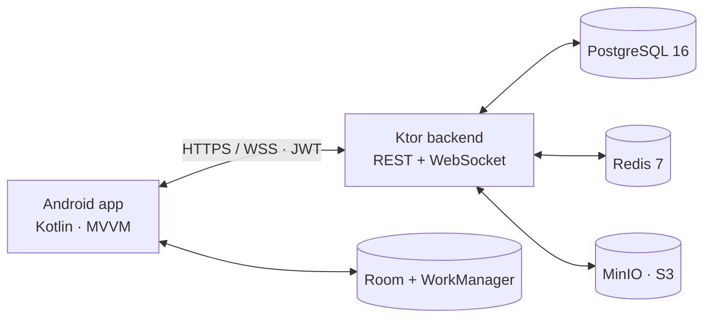

<p align="center">
  
</p>

<h1 align="center">Eilaji (علاجي)</h1>

<p align="center">Pharmacy catalog, nearby search, prescriptions, chat, orders and reminders — one self-hosted stack.</p>

<p align="center">
  <a href="https://github.com/HeshamAbuShaban/Eilaji/actions/workflows/android-ci.yml"></a>
  <a href="https://github.com/HeshamAbuShaban/Eilaji/actions/workflows/backend-ci.yml"></a>
  <a href="https://github.com/HeshamAbuShaban/Eilaji/releases/latest"></a>
  
  
  
  
</p>

## Contents

- [Features](#features)
- [Architecture](#architecture)
- [Quickstart](#quickstart)
- [Configuration](#configuration)
- [API](#api)
- [Demo data](#demo-data)
- [Project layout](#project-layout)
- [CI & releases](#ci--releases)
- [Roadmap](#roadmap)
- [License](#license)

## Features

- **Catalog** — categories, subcategories and medicines with manufacturer, pricing, prescription flags and alternatives.
- **Nearby search** — radius-based pharmacy search, map markers with a detail pager (rating, distance, open status, call and chat actions).
- **Prescriptions** — photo upload with status lifecycle through quote, acceptance and completion.
- **Chat** — WebSocket messaging with history persistence and offline queueing.
- **Cart & orders** — cart with badge, checkout with delivery address and payment method, order tracking.
- **Reminders** — exact alarms with WorkManager fallback, daily/weekly/custom intervals, dosage support, reboot-safe, backend sync.
- **Favorites & ratings** — offline-first favorites, 1–5 star pharmacy ratings with rollup averages.
- **Guest browsing** — catalog, search and map work without an account; sign-in required for prescriptions, chat and orders.
- **Two languages** — English and Arabic UI with dark-mode support.

## Architecture



| Component | Role |
|---|---|
| `app/` | Native Android client (MVVM, ViewBinding, Navigation, Retrofit, Room) |
| `eilaji-backend/` | Ktor service: auth, catalog, pharmacies, prescriptions, orders, chat, ratings |
| Postgres | Relational data, geo-search, transactions |
| Redis | Cache and pub/sub |
| MinIO | Prescription and image storage |

## Quickstart

**Prerequisites:** JDK 17+ (backend CI uses 21), Android SDK 34, Docker & Compose.

```bash
# 1. Backend + infrastructure
cd eilaji-backend
docker-compose up -d        # postgres:5432 · redis:6379 · minio:9000/9001
./gradlew :backend:run      # http://localhost:8080

# 2. Verify
curl http://localhost:8080/health
curl "http://localhost:8080/api/v1/medicines?page=0&pageSize=2"
curl "http://localhost:8080/api/v1/pharmacies/nearby?lat=31.5&lng=34.46&radius=10"
```

```bash
# 3. App — download app-debug.apk from Releases, then:
adb reverse tcp:8080 tcp:8080   # physical device
adb install -r app-debug.apk
# Emulator debug builds already target http://10.0.2.2:8080
```

**Demo accounts (password `password123`):** `patient@eilaji.com` · `pharmacist1@eilaji.com` · `pharmacist2@eilaji.com` · `admin@eilaji.com`

## Configuration

HOCON file: `eilaji-backend/backend/src/main/resources/application.conf`. Override with environment variables:

| Key | Default | Purpose |
|---|---|---|
| `database.url` / `database.user` / `database.password` | `jdbc:postgresql://localhost:5432/eilaji_db` | Postgres connection |
| `redis.url` | `redis://localhost:6379` | Cache / pub-sub |
| `minio.endpoint` / `minio.accessKey` / `minio.secretKey` | `http://localhost:9000` | Object storage |
| `jwt.secret` / `jwt.issuer` / `jwt.audience` | — | Token signing (use a 32+ char secret in production) |

See `eilaji-backend/README.md` for the full variable list.

## API

| Method & path | Description |
|---|---|
| `GET /health` | Service status |
| `GET /api/v1/medicines?page=&pageSize=&subcategoryId=` | Paginated medicines |
| `GET /api/v1/medicines/{id}` · `GET /api/v1/medicines/search?q=` | Details · full-text search |
| `GET /api/v1/medicines/categories` | Categories with subcategories |
| `GET /api/v1/pharmacies?page=&pageSize=&city=` | Pharmacy listing |
| `GET /api/v1/pharmacies/nearby?lat=&lng=&radius=` | Radius search |
| `POST /api/v1/auth/register` · `/auth/login` · `/auth/refresh` | Auth |
| `POST /api/v1/prescriptions` (multipart) · `GET /api/v1/prescriptions` | Prescription upload & list |
| `POST /api/v1/orders` · `GET /api/v1/orders` | Orders |
| `GET /api/v1/chats` · `POST /api/v1/chats` · `GET /api/v1/chats/{id}/messages` | Chat REST |
| `WS /api/v1/ws/chat?token=JWT` | Chat socket |
| `GET/POST /api/v1/favorites` | Favorites |
| `POST /api/v1/ratings` · `GET /api/v1/pharmacies/{id}/ratings` | Ratings |

## Demo data

Seeded automatically on first start (`DatabaseSeeder.kt`): 6 categories, 12 subcategories, 36 medicines, 30 pharmacies across 4 regions with ratings and open/closed status, plus 2 sample chat threads so messaging is testable without a second client.

## Project layout

```
app/src/main/java/dev/anonymous/eilaji/
├── ui/base/.../home|categories|chatting|profile|send_prescription
├── ui/other/{map,add_address,medicine,checkout,search,favorite,reminder,messaging}
├── adapters/  network/  data/repository/  reminder_system/  storage/
eilaji-backend/backend/src/main/kotlin/com/eilaji/backend/
├── controller/  service/  data/  websocket/  security/  initialization/  config/
.github/workflows/  android-ci.yml  backend-ci.yml
docs/assets/  docs/screenshots/
```

## CI & releases

- **Android CI** (JDK 17): `./gradlew assembleDebug` → `app-debug.apk` artifact on every push; `v*` tags publish a GitHub Release with the APK and setup notes.
- **Backend CI** (JDK 21, Postgres 15 + Redis 7 services): `:backend:build` + `:backend:test`.
- Latest stable: [Releases](https://github.com/HeshamAbuShaban/Eilaji/releases/latest).

## Roadmap

- Pharmacist workbench (quote inbox, stock toggles, order queue)
- Delivery zones and courier tracking
- Ranked search with filters
- Phone OTP onboarding, refill prediction, referrals

## License

Portfolio / educational use only — not licensed for commercial use or redistribution.
© Hesham AbuShaban, 2025. See [LICENSE](LICENSE).
